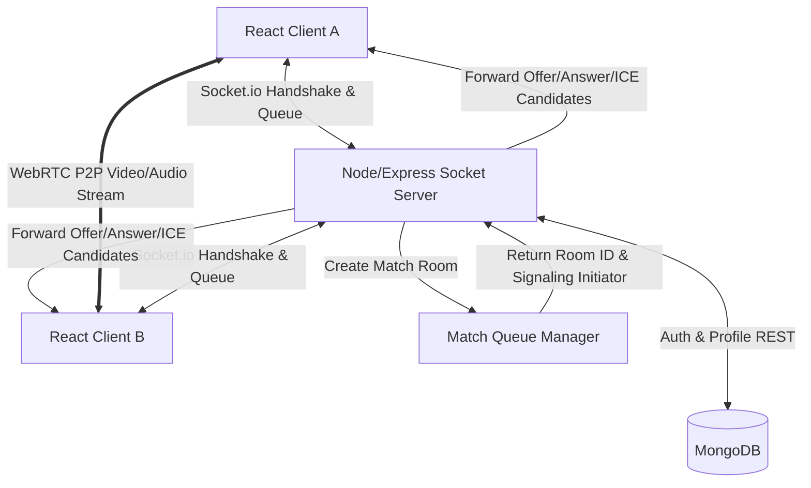

# Woomegle - Random Video Chat Platform

A complete, production-ready Omegle-style random video chat platform built with React, Node.js, Express, Socket.io, WebRTC, and MongoDB.

---

## Technical Architecture



---

## Features

1. **Vibrant Landing Page**: Glassmorphic dark styling with live matching metrics.
2. **JWT Authentication & Profile Management**: Custom avatars, languages, country details, and custom interests tags.
3. **Queue Matchmaking**: In-memory matching queue based on tags overlapping, language criteria, and location settings.
4. **WebRTC Real-time Streams**: Native browser `RTCPeerConnection` for local and remote streams, camera and audio toggles, and screen-sharing support.
5. **Real-time Messaging**: Multi-chat stream with auto-scroll, typing notifications, and clear actions.
6. **Premium Tier Features**: Unlock Razorpay checkout to access gender filters and special premium badge overlays.
7. **Security & Safety**: User blocks, reporting channels, rate-limiting, and an administration dashboard.
8. **Admin Panel**: ban/unban commands, analytics line charts, revenue tracking, and reporting checklists.

---

## Project Structure

```
app/
├── README.md
├── server/
│   ├── package.json
│   ├── .env
│   ├── server.js
│   ├── config/
│   │   └── db.js
│   ├── models/
│   │   ├── User.js
│   │   ├── Chat.js
│   │   ├── Report.js
│   │   ├── Subscription.js
│   │   └── Analytics.js
│   ├── routes/
│   │   ├── auth.js
│   │   ├── user.js
│   │   ├── report.js
│   │   ├── admin.js
│   │   └── payment.js
│   ├── socket/
│   │   ├── socketHandler.js
│   │   └── matchManager.js
│   └── middleware/
│       ├── auth.js
│       ├── admin.js
│       └── rateLimiter.js
└── client/
    ├── package.json
    ├── vite.config.js
    ├── tailwind.config.js
    ├── postcss.config.js
    ├── index.html
    └── src/
        ├── main.jsx
        ├── index.css
        ├── App.jsx
        ├── context/
        │   ├── AuthContext.jsx
        │   ├── SocketContext.jsx
        │   └── ThemeContext.jsx
        ├── hooks/
        │   └── useWebRTC.js
        ├── components/
        │   ├── Navbar.jsx
        │   └── Footer.jsx
        └── pages/
            ├── LandingPage.jsx
            ├── LoginPage.jsx
            ├── SignupPage.jsx
            ├── ChatPage.jsx
            ├── ProfilePage.jsx
            ├── FriendsPage.jsx
            ├── PremiumPage.jsx
            └── AdminDashboard.jsx
```

---

## Getting Started Locally

### Prerequisites
- Node.js (v16.0.0 or higher)
- npm (v7.0.0 or higher)
- MongoDB instance (Local community edition or MongoDB Atlas URI)

### Installation
1. Install server dependencies:
   ```bash
   cd server
   npm install
   ```
2. Set up environment configuration:
   Create a `.env` file in the `server/` directory and configure it as shown in `.env.example`.
3. Install client dependencies:
   ```bash
   cd ../client
   npm install
   ```

### Running the App
1. **Start the Backend Server**:
   ```bash
   cd server
   npm run start
   ```
   *The API server will listen on port `5000`.*
2. **Start the Frontend Development Server**:
   ```bash
   cd client
   npm run dev
   ```
   *The production app runs on `https://woomegle.com`. Requests to `/api` or `/socket.io` are securely handled by `https://api.woomegle.com`.*

---

## Deployment Instructions

### Backend (Node.js/Express)
1. Set the following environment variables on your server provider (e.g. Render, Heroku, AWS Elastic Beanstalk):
   - `NODE_ENV=production`
   - `PORT=80` (or appropriate port)
   - `MONGODB_URI` (production MongoDB database URI)
   - `JWT_SECRET` (highly secure key)
   - `RAZORPAY_KEY_ID` & `RAZORPAY_KEY_SECRET` (production Razorpay key credentials)
   - `CLIENT_URL` (the production domain where your frontend is hosted)
2. Use a process manager like `pm2` to keep the application running:
   ```bash
   npm install pm2 -g
   pm2 start server.js --name "vibecall-api"
   ```

### Frontend (React/Vite)
1. Compile the production build bundle:
   ```bash
   cd client
   npm run build
   ```
2. Vite will output static HTML/JS/CSS assets to the `client/dist` directory.
3. Deploy the contents of the `dist` directory to a static site host (e.g., Netlify, Vercel, AWS S3, or Cloudflare Pages).
4. **Important**: Configure your hosting platform to redirect all wildcard requests to `index.html` to support React Router single-page navigation.
5. In production, configure Nginx or a reverse proxy to route `/api` and `/socket.io` paths from the client URL to the backend server URL.
>>>>>>> 4b7c19d (Initial commit)
